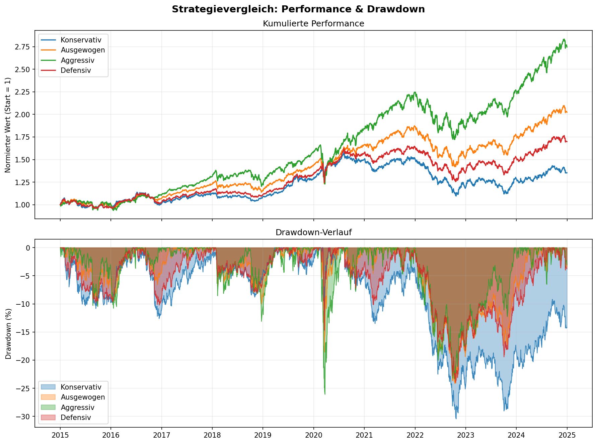
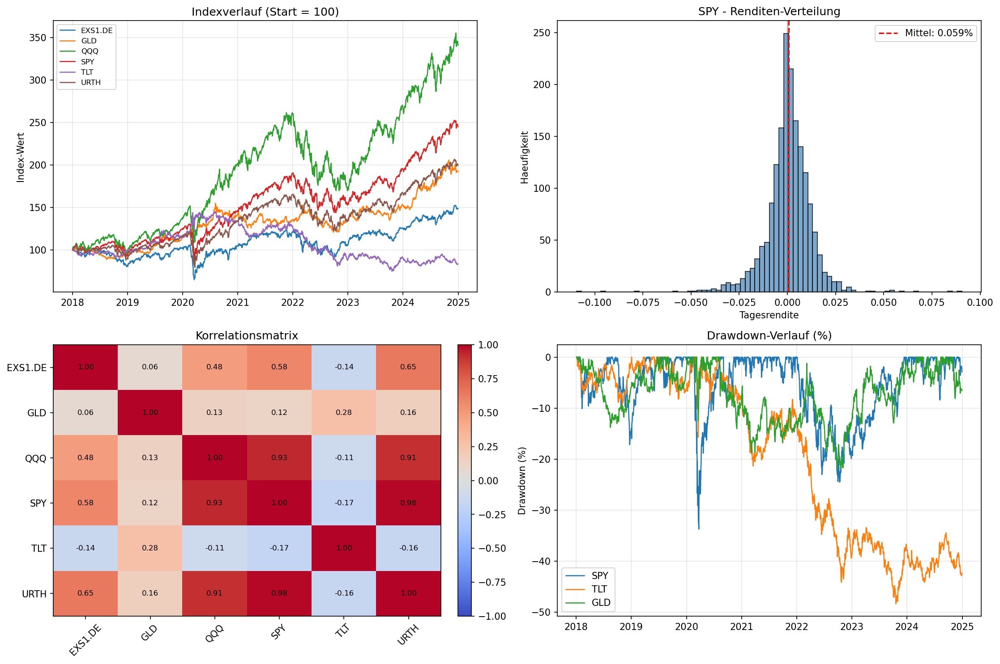
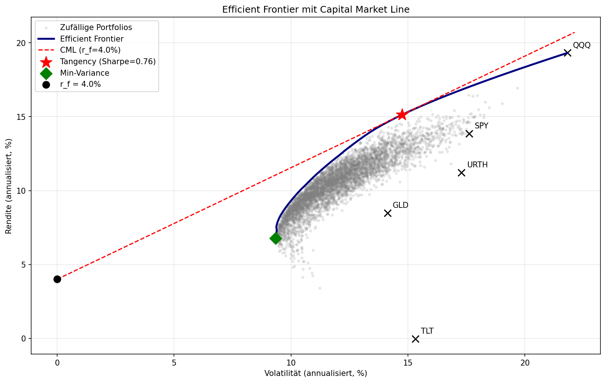
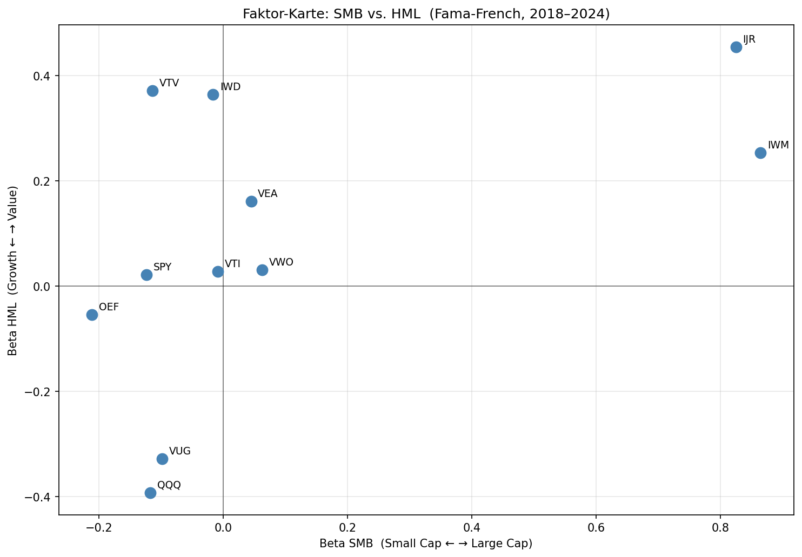

# portfolio-analytics

Quantitative Portfolio-Analyse mit Python — eigene Implementierung von Markowitz-Portfoliotheorie, Backtesting und ETF-Analyse auf realen Marktdaten.

Teil eines 5-Monats-Projekts an der Schnittstelle Mathematik und Finanzen, inspiriert von der wissenschaftlich fundierten Vermögensaufbau-Logik von Dr. Andreas Beck.

---

## Was das Projekt kann

- **Renditen-Statistik:** Volatilität, Sharpe Ratio, Max Drawdown, Verteilungs-Klassifizierung — sowohl für einzelne Renditefolgen als auch für ein Asset-Universum
- **Marktdaten-Pipeline:** Automatischer Datenabruf via yfinance, Cleaning auf gemeinsame Handelstage
- **Backtesting-Engine:** Buy-and-Hold sowie periodisch rebalancierte Portfolio-Strategien mit beliebigen Asset-Gewichtungen
- **ETF-Analyse:** Performance- und Risiko-Vergleich mehrerer Anlageklassen über lange Zeiträume
- **Visualisierung:** Indexverläufe, Renditen-Verteilungen, Korrelations-Heatmaps, Drawdown-Charts

---

## Beispiel-Ergebnisse

### Strategievergleich: 4 Asset-Allokationen über 10 Jahre

Vergleich konservativer, ausgewogener, aggressiver und defensiver Portfolios auf SPY (US-Aktien), TLT (US-Treasuries), GLD (Gold) und EXS1.DE (DAX) mit jährlichem Rebalancing.



### ETF-Übersicht: 6 Welt-Assets seit 2018

Indexverläufe, Renditen-Verteilung, Korrelationen und Drawdown-Verläufe für die wichtigsten globalen Anlageklassen.



### Phase 3 — Portfolio-Optimierung & Faktor-Analyse

**Efficient Frontier mit Capital Market Line** — Min-Variance-Portfolio, Tangency-Portfolio und CML für ein 5-Asset-Universum (SPY, QQQ, URTH, TLT, GLD).



**Faktor-Karte: SMB vs. HML** — Fama-French-3-Faktor-Exposures für 11 ETFs (Growth, Value, Small Caps, Large Caps, International). Zeigt visuell, wie sich ETFs im zweidimensionalen Faktor-Raum positionieren.



---

## Setup

```bash
pip install -r requirements.txt
```

Benötigt Python 3.10+ und folgende Bibliotheken: NumPy, Pandas, Matplotlib, yfinance.

---

## Repo-Struktur

```
portfolio-analytics/
├── README.md
├── requirements.txt
│
├── analytics.py                 # Werkzeug-Modul: Performance- und Risiko-Kennzahlen
├── backtester.py                # Werkzeug-Modul: Portfolio-Simulation mit Rebalancing
├── optimizer.py                 # Werkzeug-Modul: Markowitz-Optimierung & Frontier
├── factor_analysis.py           # Werkzeug-Modul: CAPM- und Fama-French-Regressionen
├── rendite_analyzer.py          # Eigenständiges Tool: Statistik-Report für Renditefolgen
│
├── etf_kennzahlen.py            # Anwendung: ETF-Universum-Analyse (Tabelle)
├── etf_charts.py                # Anwendung: ETF-Universum-Visualisierung
├── strategievergleich.py        # Anwendung: Portfolio-Strategien-Backtest
├── efficient_frontier_demo.py   # Anwendung: Frontier-Plot mit Tangency & CML
├── factor_profile_etfs.py       # Anwendung: Fama-French-Faktoranalyse für ETFs
│
└── plots/                       # Generierte Charts
    ├── etf_charts.png
    ├── strategievergleich.png
    ├── efficient_frontier.png
    └── faktor_karte.png
```

**Werkzeug-Module** enthalten die wiederverwendbaren Funktionen. **Anwendungs-Skripte** importieren aus den Werkzeug-Modulen und produzieren konkrete Analysen.

---

## Wie ausführen

Alle Anwendungs-Skripte sind eigenständig ausführbar:

```bash
python rendite_analyzer.py          # Beispiel-Renditen analysieren
python etf_kennzahlen.py            # ETF-Kennzahlen-Tabelle ausgeben
python etf_charts.py                # ETF-Charts erzeugen (in plots/)
python strategievergleich.py        # Strategien backtesten und plotten
python efficient_frontier_demo.py   # Frontier-Plot mit Tangency & CML
python factor_profile_etfs.py       # Faktor-Exposures für ETF-Universum
```

Beim ersten Lauf werden die Daten über yfinance live von Yahoo Finance geladen — dafür ist eine Internetverbindung nötig.

---

## Methodische Notizen

- Renditen sind Closing-zu-Closing (täglich), berechnet aus dividend- und split-bereinigten Schlusskursen (`auto_adjust=True`)
- Annualisierung: Renditen mit Faktor 252 (Handelstage pro Jahr), Volatilitäten mit √252 (Wurzel-T-Regel)
- Volatilität wird auf den **Renditen** berechnet, nicht auf den Preisen
- Annualisierte Rendite im Backtester als geometrisches Mittel (Compound Annual Growth Rate), um Verzerrung durch arithmetische Mittelung über lange Zeiträume zu vermeiden
- Stichproben-Statistik (ddof=1) für Standardabweichungen
- Rebalancing-Frequenzen: jährlich, quartalsweise, monatlich, oder Buy-and-Hold
- Keine Transaktionskosten — bei Interpretation der Ergebnisse beachten

---

## Status

**Aktueller Stand:** Phase 3 von 5 abgeschlossen.

- Phase 1 (Python-Grundlagen): abgeschlossen
- Phase 2 (NumPy, Pandas, yfinance, Visualisierung, Backtesting): abgeschlossen
- Phase 3 (Portfolio-Optimierung, Efficient Frontier, CAPM, Fama-French): abgeschlossen
- Phase 4 (Faktor-Modelle, Faktorinvesting): geplant
- Phase 5 (Monte-Carlo-Simulation, finales Analyse-Projekt): geplant

---

## Hintergrund

Das Projekt entsteht in einer fünfmonatigen Übergangsphase zwischen Mathematik-Bachelor (Universität Münster, Abschluss mit Auszeichnung) und Master-Studium an der Schnittstelle Mathematik und Finanzen.

Ziel ist es, die mathematischen Grundlagen der modernen Portfoliotheorie nicht nur theoretisch zu verstehen, sondern in eigenständig implementierten, transparenten und auf realen Daten validierten Tools umzusetzen — als Vorbereitung auf eine Karriere im quantitativen Asset Management beziehungsweise in der wissenschaftlich fundierten Vermögensverwaltung.

